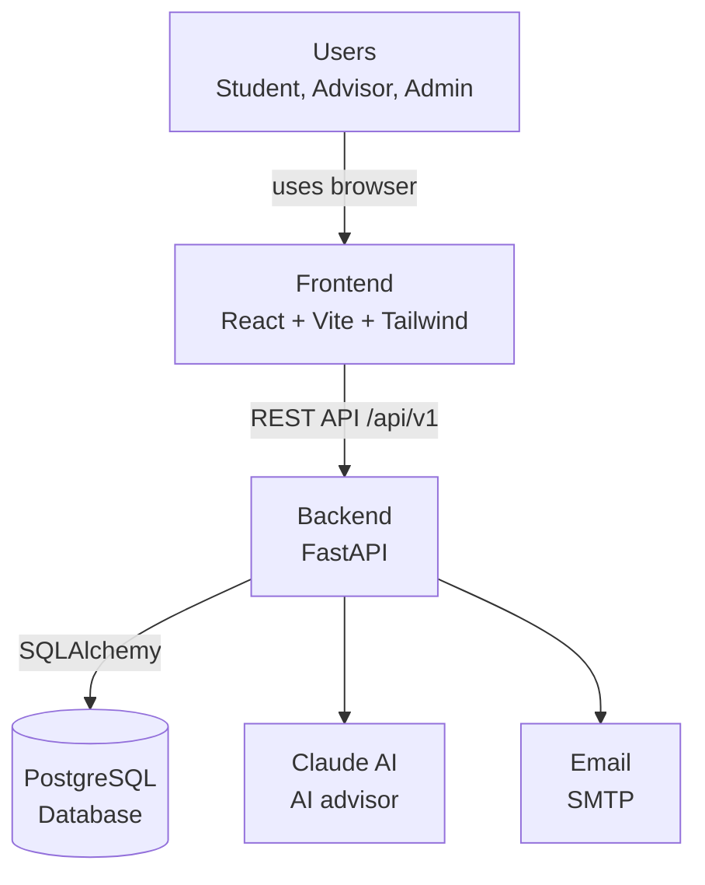

# Acadmate Architecture

```mermaid
flowchart TB
    U["Users<br/>Student, Advisor, Admin"]
    F["Frontend<br/>React + Vite + Tailwind"]
    B["Backend<br/>FastAPI"]
    D[("PostgreSQL<br/>Database")]
    AI["Claude AI<br/>AI advisor"]
    M["Email<br/>SMTP"]

    U -->|uses browser| F
    F -->|REST API /api/v1| B
    B -->|SQLAlchemy| D
    B --> AI
    B --> M
```
